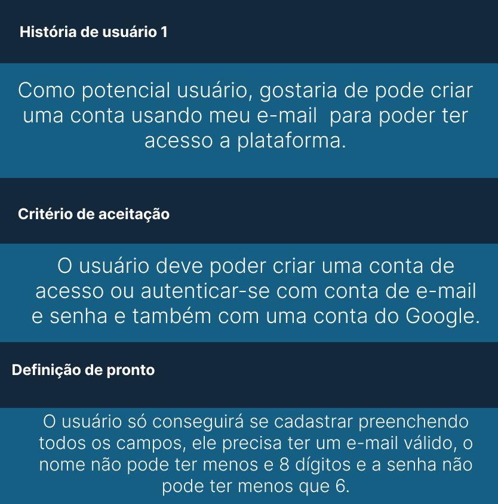
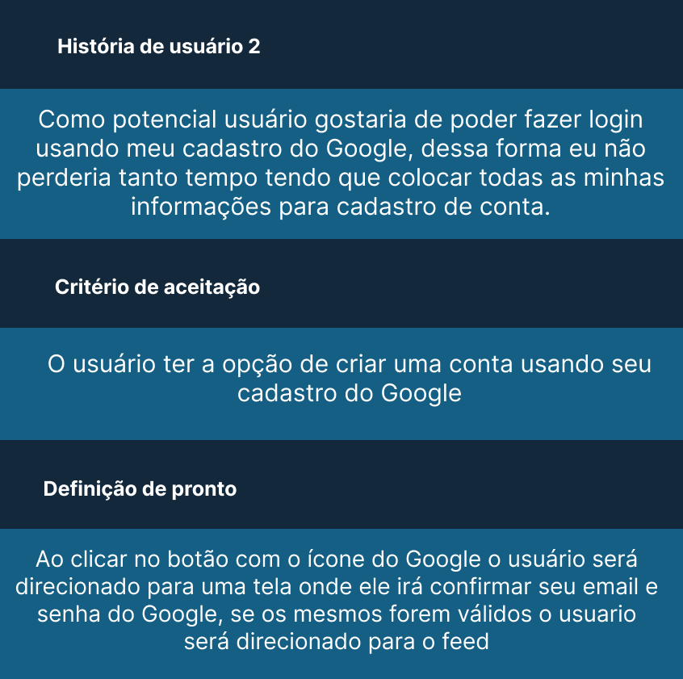
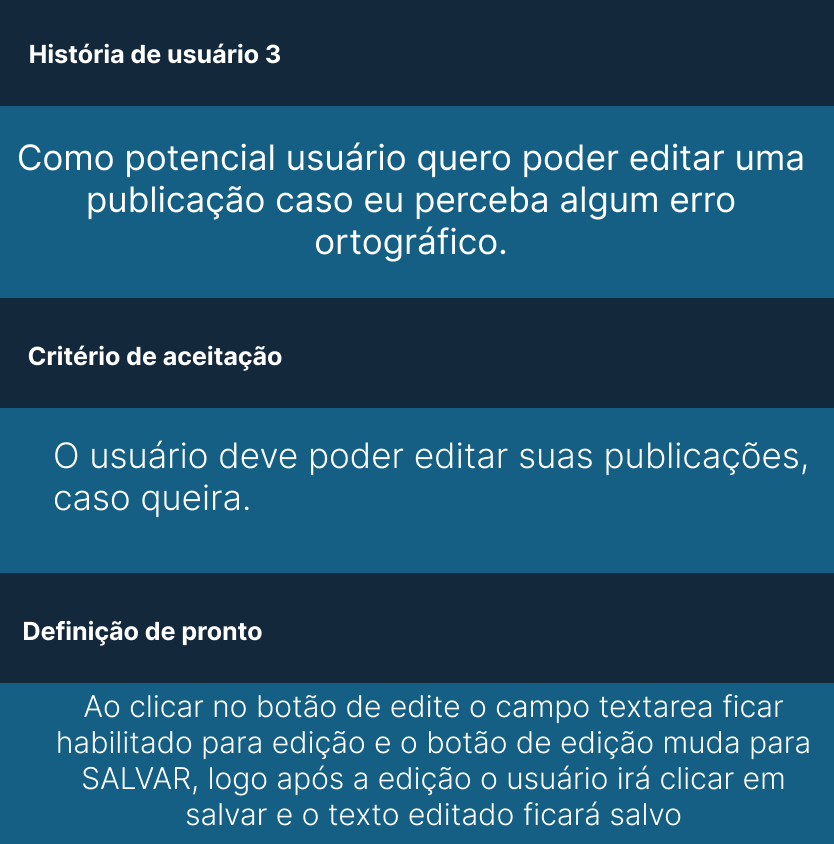
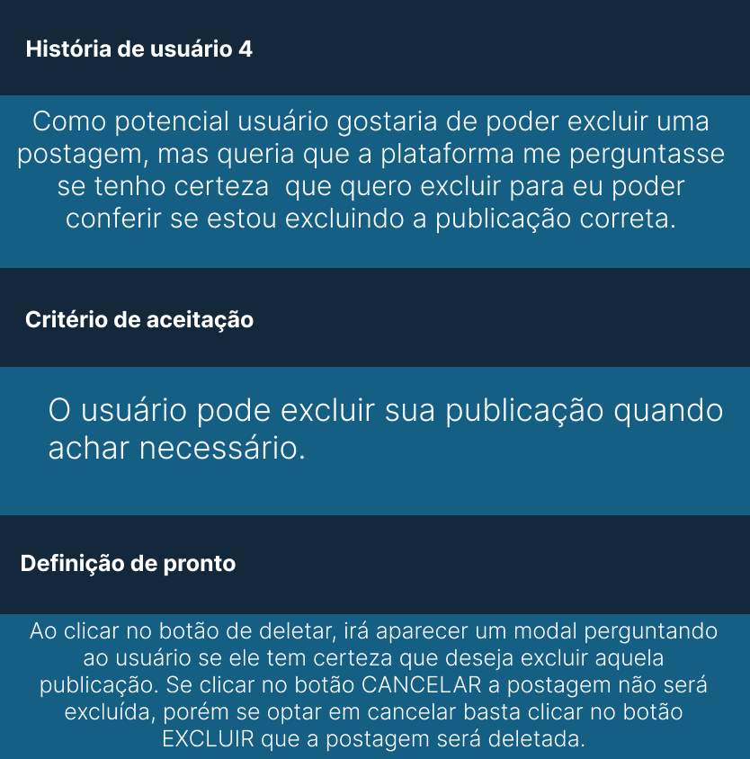
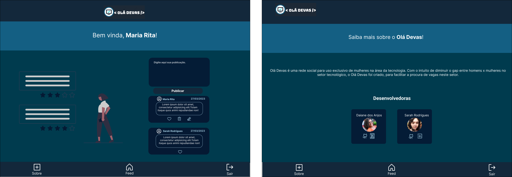

# Criando uma Rede Social

## Sobre o Olá Devas

Instagram, Snapchat, Twitter, Facebook, Twitch, Linkedin, etc. As redes sociais
invadiram nossas vidas. Nós as amamos ou odiamos, e muitas pessoas não conseguem
viver sem elas.
Há redes sociais de todo tipo para todos os tipos de interesse.

  Olá devas é uma rede social para uso exclusivo de mulheres do setor tecnológico
  Com o intuíto de diminuir o gap entre homens x mulheres no setor de tecnologia, o olá Devas, foi criado para facilitar a procura de vagas neste setor.
  Nela a usuária poderá criar uma conta de acesso, logar-se com ela, criar, editar, deletar e dar likes em publicações.

***

## Histórias de usuário

Depois de entender as necessidades dos nossos usuários, escrevemos as Histórias de
Usuário. Elas representam tudo o que ele precisa fazer/ver na Rede Social.
Cada uma de suas histórias de usuário possui:

* **Critérios de aceitação:** tudo o que deve acontecer para satisfazer as
  necessidades do usuário.

* **Definição de pronto:** todos os aspectos técnicos que devem ser atendidos
  para que, como equipe, saibam que essa história está finalizada e pronta para
  ser publicada. **Todas** suas histórias de usuário (com exceções), devem
  incluir esses aspectos em sua definição de pronto (além de tudo o que precisa
  adicionar):

  - Ser uma SPA.
  - Ser _responsivo_.
  - Receber _code review_ de pelo menos uma parceira de outra equipe.
  - Fazer _tests_ unitários.
  - Fazer testes manuais buscando erros e imperfeições simples.
  - Fazer testes de usabilidade e incorporar o _feedback_ dos usuários como
    melhorias.
  - Fazer deploy do aplicativo e marcar a versão (git tag).

### História 1

### História 2

### História 3    

### História 4    

### História 5    

### Login e cadastro
* _Login_ com Firebase:
  - Para o _login_ e postagens na timeline, você pode usar o
    [Firebase](https://firebase.google.com/products/database/)
  - O usuário deve poder criar uma conta de acesso ou autenticar-se com conta de
    e-mail e senha e também com uma conta do Google.
* Validações:
  - Somente usuários com contas válidas têm acesso permitido.
  - Não haver usuários repetidos.
  - O que o usuário digita no campo de senha (_input_) deve ser secreto.
* Comportamento:
  - Quando o formulário de registro ou login é enviado, ele deve ser validado.
  - Se houver erros, mensagens descritivas devem ser exibidas para ajudar o
    usuário.

  #### Protótipos Desktop 
  

  #### Protótipos Mobile
  

### Timeline/linha do tempo e sobre

* Validações:
  - Ao publicar, deve ser validado se há conteúdo no _input_.
* Comportamento:
  - Ao recarregar o aplicativo, é necessário verificar se o usuário está
    _logado_ antes de exibir o conteúdo,
  - Conseguir publicar um _post_.
  - Poder dar e remover _likes_ em uma publicação. Máximo de um por usuário.
  - Visualizar contagem de _likes_.
  - Poder excluir uma postagem específica.
  - Solicitar confirmação antes de excluir um _post_.
  - Ao clicar em editar um _post_, você deve alterar o texto para um _input_ que
    permite editar o texto e salvar as alterações.
  - Ao salvar as alterações, você deve voltar ao texto normal, mas com a
    informação editada.
  - Ao recarregar a página, poder ver os textos editados.

  #### Protótipos Desktop 
  

  #### Protótipos Mobile
  

***

## Objetivos de aprendizagem

### HTML

- [ ] **Uso de HTML semântico**

  

Links

  * [HTML semântico](https://curriculum.laboratoria.la/pt/topics/html/02-html5/02-semantic-html)
  * [Semantics in HTML - MDN](https://developer.mozilla.org/en-US/docs/Glossary/Semantics#Semantics_in_HTML)

### CSS

- [ ] **Uso de seletores de CSS**

  

Links

  * [Intro a CSS](https://curriculum.laboratoria.la/pt/topics/css/01-css/01-intro-css)
  * [CSS Selectors - MDN](https://developer.mozilla.org/pt_BR/docs/Web/CSS/CSS_Selectors)

- [ ] **Modelo de caixa (box model): borda, margem, preenchimento**

  

Links

  * [Modelo de Caixa e Display](https://curriculum.laboratoria.la/pt/topics/css/01-css/02-boxmodel-and-display)
  * [The box model - MDN](https://developer.mozilla.org/en-US/docs/Learn/CSS/Building_blocks/The_box_model)
  * [Introduction to the CSS box model - MDN](https://developer.mozilla.org/en-US/docs/Web/CSS/CSS_Box_Model/Introduction_to_the_CSS_box_model)
  * [CSS display - MDN](https://developer.mozilla.org/pt-BR/docs/Web/CSS/display)
  * [display - CSS Tricks](https://css-tricks.com/almanac/properties/d/display/)

- [ ] **Uso de flexbox em CSS**

  

Links

  * [A Complete Guide to Flexbox - CSS Tricks](https://css-tricks.com/snippets/css/a-guide-to-flexbox/)
  * [Flexbox Froggy](https://flexboxfroggy.com/#pt-br)
  * [Flexbox - MDN](https://developer.mozilla.org/en-US/docs/Learn/CSS/CSS_layout/Flexbox)

- [ ] **Uso de CSS Grid Layout**

  

Links

  * [A Complete Guide to Grid - CSS Tricks](https://css-tricks.com/snippets/css/complete-guide-grid/)
  * [Grids - MDN](https://developer.mozilla.org/en-US/docs/Learn/CSS/CSS_layout/Grids)

### Web APIs

- [ ] **Uso de seletores de DOM**

  

Links

  * [Modificando o DOM](https://curriculum.laboratoria.la/pt/topics/browser/02-dom/03-1-dom-methods-selection)
  * [Introdução ao DOM - MDN](https://developer.mozilla.org/pt-BR/docs/Web/API/Document_Object_Model/Introduction)
  * [Locating DOM elements using selectors - MDN](https://developer.mozilla.org/en-US/docs/Web/API/Document_object_model/Locating_DOM_elements_using_selectors)

- [ ] **Manipulação de eventos de DOM (listeners, propagação, delegação)**

  

Links

  * [Introdução a eventos - MDN](https://developer.mozilla.org/pt-BR/docs/Learn/JavaScript/Building_blocks/Events)
  * [EventTarget.addEventListener() - MDN](https://developer.mozilla.org/pt-BR/docs/Web/API/EventTarget/addEventListener)
  * [EventTarget.removeEventListener() - MDN](https://developer.mozilla.org/pt-BR/docs/Web/API/EventTarget/removeEventListener)
  * [Objeto Event](https://developer.mozilla.org/pt-BR/docs/Web/API/Event)

- [ ] **Manipulação dinâmica de DOM**

  

Links

  * [Introdução ao DOM](https://developer.mozilla.org/pt-BR/docs/DOM/Referencia_do_DOM/Introdu%C3%A7%C3%A3o)
  * [Node.appendChild() - MDN](https://developer.mozilla.org/pt-BR/docs/Web/API/Node/appendChild)
  * [Document.createElement() - MDN](https://developer.mozilla.org/pt-BR/docs/Web/API/Document/createElement)
  * [Document.createTextNode()](https://developer.mozilla.org/pt-BR/docs/Web/API/Document/createTextNode)
  * [Element.innerHTML - MDN](https://developer.mozilla.org/pt-BR/docs/Web/API/Element/innerHTML)
  * [Node.textContent - MDN](https://developer.mozilla.org/pt-BR/docs/Web/API/Node/textContent)

- [ ] **Routing (History API, evento hashchange, window.location)**

  

Links

  * [Manipulando o histórico do navegador - MDN](https://developer.mozilla.org/pt-BR/docs/Web/API/History_API)

### JavaScript

- [ ] **Arrays (arranjos)**

  

Links

  * [Arranjos](https://curriculum.laboratoria.la/pt/topics/javascript/04-arrays)
  * [Array - MDN](https://developer.mozilla.org//pt-BR/docs/Web/JavaScript/Reference/Global_Objects/Array/)
  * [Array.prototype.sort() - MDN](https://developer.mozilla.org/pt-BR/docs/Web/JavaScript/Reference/Global_Objects/Array/sort)
  * [Array.prototype.forEach() - MDN](https://developer.mozilla.org/pt-BR/docs/Web/JavaScript/Reference/Global_Objects/Array/forEach)
  * [Array.prototype.map() - MDN](https://developer.mozilla.org/pt-BR/docs/Web/JavaScript/Reference/Global_Objects/Array/map)
  * [Array.prototype.filter() - MDN](https://developer.mozilla.org/pt-BR/docs/Web/JavaScript/Reference/Global_Objects/Array/filter)
  * [Array.prototype.reduce() - MDN](https://developer.mozilla.org/pt-BR/docs/Web/JavaScript/Reference/Global_Objects/Array/Reduce)

- [ ] **Objetos (key, value)**

  

Links

  * [Objetos em JavaScript](https://curriculum.laboratoria.la/pt/topics/javascript/05-objects/01-objects)

- [ ] **Diferenciar entre tipos de dados primitivos e não primitivos**

- [ ] **Variáveis (declaração, atribuição, escopo)**

  

Links

  * [Valores, tipos de dados e operadores](https://curriculum.laboratoria.la/pt/topics/javascript/01-basics/01-values-variables-and-types)
  * [Variáveis](https://curriculum.laboratoria.la/pt/topics/javascript/01-basics/02-variables)

- [ ] **Uso de condicionais (if-else, switch, operador ternário, lógica booleana)**

  

Links

  * [Estruturas condicionais e repetitivas](https://curriculum.laboratoria.la/pt/topics/javascript/02-flow-control/01-conditionals-and-loops)
  * [Tomando decisões no seu código — condicionais - MDN](https://developer.mozilla.org/pt-BR/docs/Learn/JavaScript/Building_blocks/conditionals)

- [ ] **Uso de laços (while, for, for..of)**

  

Links

  * [Laços (Loops)](https://curriculum.laboratoria.la/pt/topics/javascript/02-flow-control/02-loops)
  * [Laços e iterações - MDN](https://developer.mozilla.org/pt-BR/docs/Web/JavaScript/Guide/Loops_and_iteration)

- [ ] **Funções (params, args, return)**

  

Links

  * [Funções (controle de fluxo)](https://curriculum.laboratoria.la/pt/topics/javascript/02-flow-control/03-functions)
  * [Funções clássicas](https://curriculum.laboratoria.la/pt/topics/javascript/03-functions/01-classic)
  * [Arrow Functions](https://curriculum.laboratoria.la/pt/topics/javascript/03-functions/02-arrow)
  * [Funções — blocos reutilizáveis de código - MDN](https://developer.mozilla.org/pt-BR/docs/Learn/JavaScript/Building_blocks/Functions)

- [ ] **Testes unitários (unit tests)**

  

Links

  * [Introdução ao Jest - Documentação oficial](https://jestjs.io/docs/pt-BR/getting-started)

- [ ] **Testes assíncronos**

  

Links

  * [Testando Código Assíncrono - Documentação oficial](https://jestjs.io/docs/pt-BR/asynchronous)

- [ ] **Uso de mocks e espiões**

  

Links

  * [Simulações Manuais - Documentação oficial](https://jestjs.io/docs/pt-BR/manual-mocks)

- [ ] **Módulos de ECMAScript (ES modules)**

  

Links

  * [import - MDN](https://developer.mozilla.org/pt-BR/docs/Web/JavaScript/Reference/Statements/import)
  * [export - MDN](https://developer.mozilla.org/pt-BR/docs/Web/JavaScript/Reference/Statements/export)

- [ ] **Uso de linter (ESLINT)**

- [ ] **Uso de identificadores descritivos (Nomenclatura e Semântica)**

- [ ] **Diferença entre expressões (expressions) e declarações (statements)**

- [ ] **Callbacks**

  

Links

  * [Função Callback - MDN](https://developer.mozilla.org/pt-BR/docs/Glossario/Callback_function)

- [ ] **Promessas**

  

Links

  * [Promise - MDN](https://developer.mozilla.org/es/docs/Web/JavaScript/Reference/Global_Objects/Promise)
  * [How to Write a JavaScript Promise - freecodecamp (em inglês)](https://www.freecodecamp.org/news/how-to-write-a-javascript-promise-4ed8d44292b8/)

### Controle de Versões (Git e GitHub)

- [ ] **Git: Instalação e configuração**

- [ ] **Git: Controle de versão com git (init, clone, add, commit, status, push, pull, remote)**

- [ ] **Git: Integração de mudanças entre ramos (branch, checkout, fetch, merge, reset, rebase, tag)**

- [ ] **GitHub: Criação de contas e repositórios, configuração de chave SSH**

- [ ] **GitHub: Implantação com GitHub Pages**

  

Links

  * [Site oficial do GitHub Pages](https://pages.github.com/)

- [ ] **GitHub: Colaboração pelo Github (branches | forks | pull requests | code review | tags)**

- [ ] **GitHub: Organização pelo Github (projects | issues | labels | milestones | releases)**

### Centrado no usuário

- [ ] **Desenhar e desenvolver um produto ou serviço colocando as usuárias no centro**

### Design de produto

- [ ] **Criar protótipos para obter feedback e iterar**

- [ ] **Aplicar os princípios de desenho visual (contraste, alinhamento, hierarquia)**

### Pesquisa

- [ ] **Planejar e executar testes de usabilidade**

### Firebase

- [ ] **Firebase Auth**

  

Links

  * [Primeiros passos com o Firebase Authentication em sites - Documentação oficial](https://firebase.google.com/docs/auth/web/start?hl=pt-BR)
  * [Gerenciar usuários no Firebase (onAuthStateChanged) - Documentação oficial](https://firebase.google.com/docs/auth/web/manage-users?hl=pt-BR)

- [ ] **Firestore**

  

Links

  * [Firestore - Documentação oficial](https://firebase.google.com/docs/firestore?hl=pt-BR)
  * [Regras de segurança do Firebase - Documentação oficial](https://firebase.google.com/docs/rules?hl=pt-BR)
  * [Receber atualizações em tempo real com o Cloud Firestore - Documentação oficial](https://firebase.google.com/docs/firestore/query-data/listen?hl=pt-BR)

