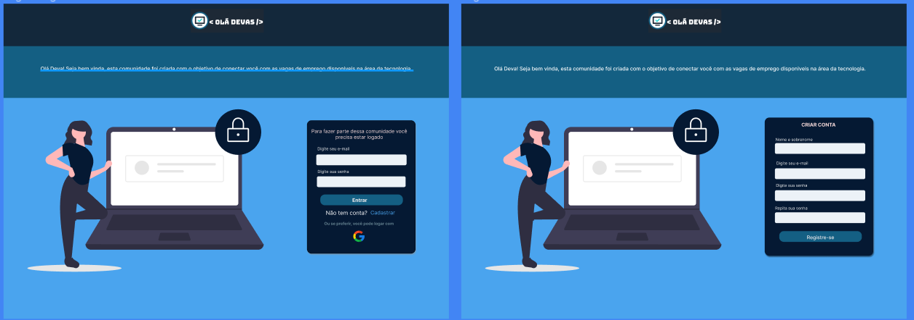
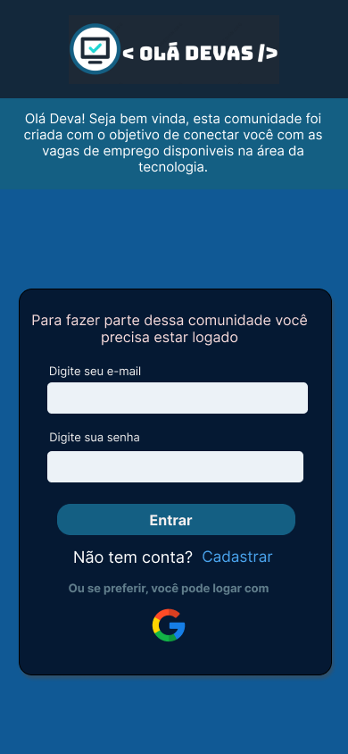
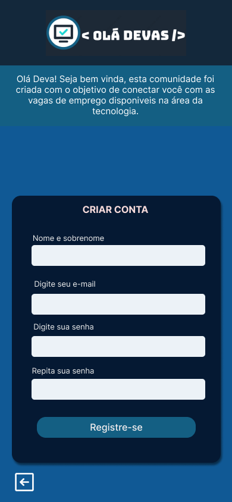
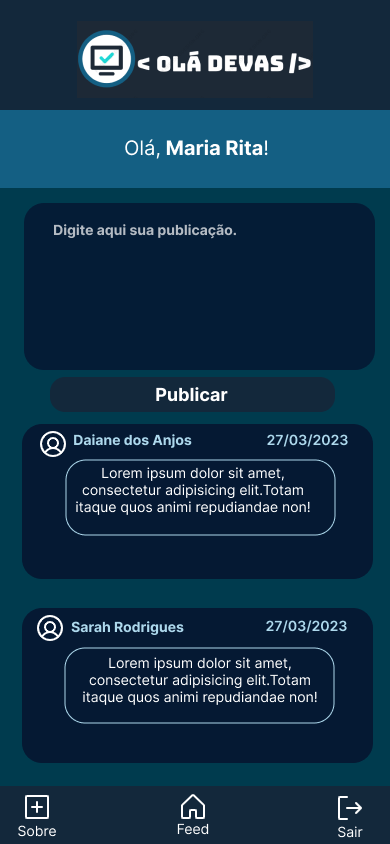
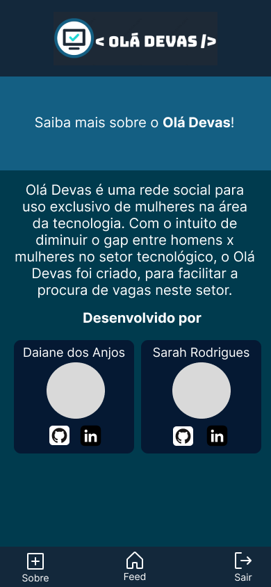

# Criando uma Rede Social

## Índice

Instagram, Snapchat, Twitter, Facebook, Twitch, Linkedin, etc. As redes sociais
invadiram nossas vidas. Nós as amamos ou odiamos, e muitas pessoas não conseguem
viver sem elas.
Há redes sociais de todo tipo para todos os tipos de interesse.

  Olá devas é uma rede social para uso exclusivo de mulheres do setor tecnológico
  Com o intuíto de diminuir o gap entre homens x mulheres no setor de tecnologia, o olá Devas, foi criado para facilitar a procura de vagas neste setor.
  Nela a usuária poderá criar uma conta de acesso, logar-se com ela, criar, editar, deletar e dar likes em publicações.

***

## Prototipos do projeto
##### Protótipos Desktop 
    

##### Protótipos Mobile

 
 
 
